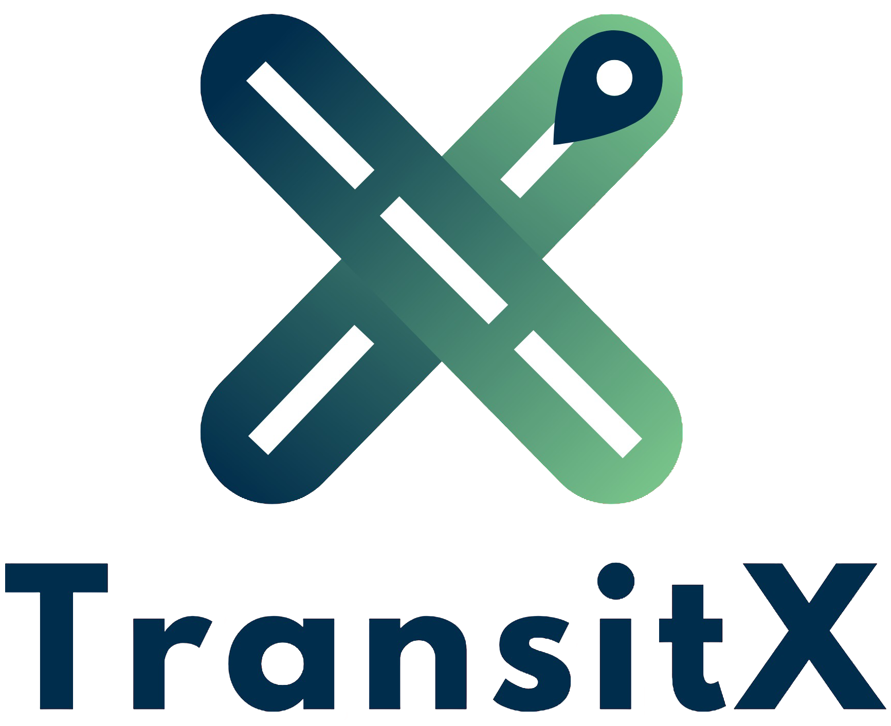

# 🚍 TransitX – Plateforme de Mobilité Durable

TransitX est une application web destinée à améliorer la mobilité urbaine grâce au covoiturage, à la gestion des bus, et à la livraison intelligente. Elle vise à promouvoir des déplacements plus écologiques, efficaces et durables.

## 🔧 Technologies

- Frontend : HTML5, CSS3, JavaScript
- Backend : PHP 8
- Base de données : MySQL
- Cartographie : Leaflet.js, OpenRouteService API

## 🧩 Modules Principaux

- Utilisateurs (clients, chauffeurs, employés, administrateurs)
- Covoiturage (création et consultation des trajets)
- Livraison (gestion des colis par les employés)
- Bus (gestion des trajets)
- Blog (articles et commentaires)

## 👥 Rôles et Accès

| Rôle         | Accès aux modules                                             |
|--------------|---------------------------------------------------------------|
| Administrateur | Tous les modules                                             |
| Employé       | Livraison, Blog                                              |
| Client        | Consultation : Covoiturage, Bus, Livraison, Blog             |

## 🎯 Objectifs Durables (ODD)

TransitX soutient les ODD suivants :

- ODD 9 : Infrastructures de transport intelligentes
- ODD 11 : Mobilité urbaine écologique
- ODD 13 : Réduction des émissions via transport partagé

## 🎨 Charte Graphique

- 🎨 Couleurs : `#97c3a2`, `#1f4f65`, `#d7dd83`, `#f9d86d`, `#ffffff`

© 2025 TransitX | Propulsé par l’équipe Pentavision
